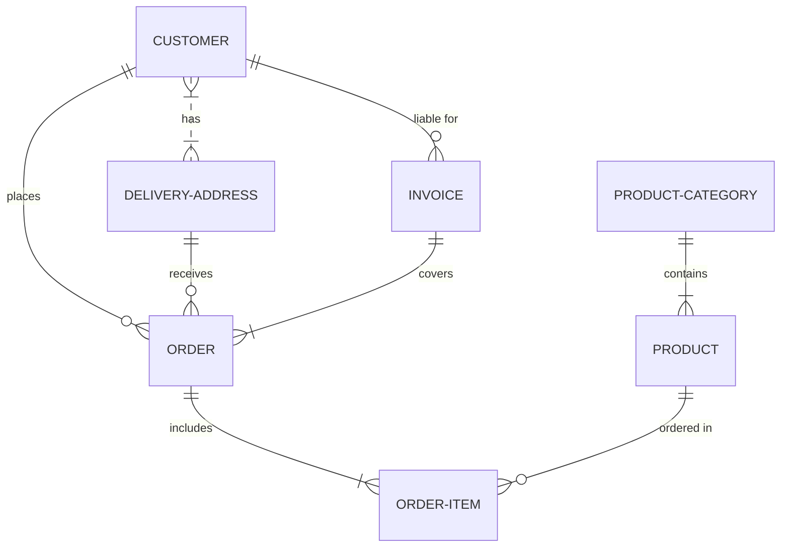

# Proyecto de Estudio!

    
**“Tienda de emprendedores regionales”**

**Asignatura**: Bases de Datos I (FaCENA-UNNE)

**Integrantes**:

- Aquino, Ruth.
- Rodriguez Antorena, Milo Tahiel.
- Rojas, Karen Denise.
- Sandoval Maria Victoria
- Soto, Belen E.

**Año**: 2025

## CAPÍTULO I: INTRODUCCIÓN

### Caso de estudio

El caso de estudio seleccionado para este trabajo es una Aplicación Web de E-commerce,
orientada a brindar un espacio de comercialización a los emprendedores regionales de la
ciudad de Corrientes Capital. El sistema está diseñado para facilitar la promoción, gestión y
venta de productos locales, con un enfoque inclusivo y social que favorezca la digitalización de
pequeños negocios.
Este sistema se ocupa específicamente de:

● Gestionar los usuarios registrados, distinguiendo entre emprendedores, clientes y
administradores de la plataforma.

● Permitir a los emprendedores publicar, editar y eliminar sus productos, manteniendo
información relevante como nombre, descripción, precio, stock y categoría.

● Facilitar a los clientes la exploración de productos, la conformación de un carrito de
compras y la posterior generación de órdenes de compra.

● Administrar las ventas realizadas, con acceso tanto para el cliente (historial de compras)
como para el emprendedor (registro de ventas).

● Integrar y controlar los métodos de pago disponibles, garantizando transacciones
seguras.

● Ofrecer distintas opciones de entrega de los productos adquiridos (envío, retiro en punto
de entrega o retiro personal). OPCIONAL

● Posibilitar la notificación automática a los emprendedores ante ventas o consultas
recibidas.

### Alcance
El alcance de la plataforma abarca la comercialización de productos en el ámbito regional,
permitiendo que los emprendedores locales tengan mayor visibilidad y alcancen una base de
clientes más amplia.
Por otra parte, se establecen los siguientes límites:

● No se contemplan funcionalidades de reseñas o valoraciones de productos por parte de
los clientes.

● No se implementa la gestión de devoluciones ni de proveedores externos.

● La administración de campañas de marketing digital, difusión o soporte externo queda
fuera del alcance del sistema

### Definición o planteamiento del problema

Pellentesque interdum aliquam magna sit amet rutrum. Nulla aliquam ligula nec quam iaculis dictum. In cursus aliquam cursus. Nullam a sem vel sapien iaculis finibus. Donec aliquam dictum viverra. Etiam ut orci lacus.

## CAPITULO II: MARCO CONCEPTUAL O REFERENCIAL

**TEMA 1 " ---- "** 
Ut sed imperdiet risus. Maecenas vestibulum arcu vitae orci pretium pharetra. Suspendisse potenti. Fusce massa libero, fermentum eget elit in, tincidunt fermentum nunc. Cras imperdiet nisl elit, elementum gravida enim accumsan vel. Sed in sapien quis ante consectetur commodo id non nulla. Aenean lacinia, dolor convallis semper mattis, ante orci elementum nunc, eget feugiat risus neque in urna. Ut ut quam nec risus mollis convallis ornare ac odio. Phasellus efficitur posuere nibh, eget tempor augue pellentesque ac. Ut enim sem, imperdiet non est ut, blandit posuere dui. Curabitur at purus orci. Interdum et malesuada fames ac ante ipsum primis in faucibus.

**TEMA 2 " ----- "** 
Ut sed imperdiet risus. Maecenas vestibulum arcu vitae orci pretium pharetra. Suspendisse potenti. Fusce massa libero, fermentum eget elit in, tincidunt fermentum nunc. Cras imperdiet nisl elit, elementum gravida enim accumsan vel. Sed in sapien quis ante consectetur commodo id non nulla. Aenean lacinia, dolor convallis semper mattis, ante orci elementum nunc, eget feugiat risus neque in urna. Ut ut quam nec risus mollis convallis ornare ac odio. Phasellus efficitur posuere nibh, eget tempor augue pellentesque ac. Ut enim sem, imperdiet non est ut, blandit posuere dui. Curabitur at purus orci. Interdum et malesuada fames ac ante ipsum primis in faucibus.

...

## CAPÍTULO III: METODOLOGÍA SEGUIDA 

Donec lobortis tincidunt erat, non egestas mi volutpat in. Cras ante purus, luctus sed fringilla non, ullamcorper at eros.

 **a) Cómo se realizó el Trabajo Práctico**
Vestibulum rutrum feugiat molestie. Nunc id varius augue. Ut augue mauris, venenatis et lacus ut, mattis blandit urna. Fusce lobortis, quam non vehicula scelerisque, nisi enim ultrices diam, ac tristique libero ex nec orci.

 **b) Herramientas (Instrumentos y procedimientos)**
Donec lobortis tincidunt erat, non egestas mi volutpat in. Cras ante purus, luctus sed fringilla non, ullamcorper at eros. Integer interdum id orci id rutrum. Curabitur facilisis lorem sed metus interdum accumsan. 

## CAPÍTULO IV: DESARROLLO DEL TEMA / PRESENTACIÓN DE RESULTADOS 

Maecenas molestie lacus tincidunt, placerat dolor et, ullamcorper erat. Mauris tortor nisl, ultricies ac scelerisque nec, feugiat in nibh. Pellentesque interdum aliquam magna sit amet rutrum. 

### Diagrama conceptual (opcional)
Ejemplo usando Live Editor https://mermaid.js.org/ (ejemplo opcional)

### Diagrama relacional

### Diccionario de datos

Acceso al documento [PDF](doc/diccionario_datos.pdf) del diccionario de datos.

### Desarrollo TEMA 1 "----"

Fusce auctor finibus lectus, in aliquam orci fermentum id. Fusce sagittis lacus ante, et sodales eros porta interdum. Donec sed lacus et eros condimentum posuere. 

> Acceder a la siguiente carpeta para la descripción completa del tema [scripts-> tema_1](script/tema01_nombre_tema)

### Desarrollo TEMA 2 "----"

Proin aliquet mauris id ex venenatis, eget fermentum lectus malesuada. Maecenas a purus arcu. Etiam pellentesque tempor dictum. 

> Acceder a la siguiente carpeta para la descripción completa del tema [scripts-> tema_2](script/tema02_nombre_tema)

... 

## CAPÍTULO V: CONCLUSIONES

Nunc sollicitudin purus quis ante sodales luctus. Proin a scelerisque libero, vitae pharetra lacus. Nunc finibus, tellus et dictum semper, nisi sem accumsan ligula, et euismod quam ex a tellus. 

## BIBLIOGRAFÍA DE CONSULTA

 1. List item
 2. List item
 3. List item
 4. List item
 5. List item

