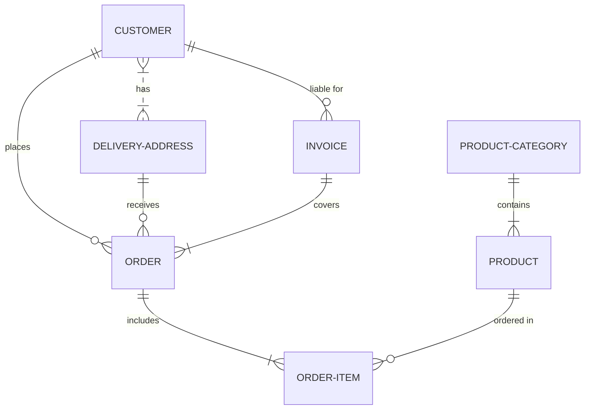

# Proyecto de Estudio

    
**“Tienda de emprendedores regionales”**

**Asignatura**: Bases de Datos I (FaCENA-UNNE)

**Integrantes**:

- Aquino, Ruth.
- Rodriguez Antorena, Milo Tahiel.
- Rojas, Karen Denise.
- Sandoval Maria Victoria
- Soto, Belen E.

**Año**: 2025

## CAPÍTULO I: INTRODUCCIÓN

### Caso de estudio

El caso de estudio seleccionado para este trabajo es una Aplicación Web de E-commerce,
orientada a brindar un espacio de comercialización a los emprendedores regionales de la
ciudad de Corrientes Capital. El sistema está diseñado para facilitar la promoción, gestión y
venta de productos locales, con un enfoque inclusivo y social que favorezca la digitalización de
pequeños negocios.
Este sistema se ocupa específicamente de:

● Gestionar los usuarios registrados, distinguiendo entre emprendedores, clientes y
administradores de la plataforma.

● Permitir a los emprendedores publicar, editar y eliminar sus productos, manteniendo
información relevante como nombre, descripción, precio, stock y categoría.

● Facilitar a los clientes la exploración de productos, la conformación de un carrito de
compras y la posterior generación de órdenes de compra.

● Administrar las ventas realizadas, con acceso tanto para el cliente (historial de compras)
como para el emprendedor (registro de ventas).

● Integrar y controlar los métodos de pago disponibles, garantizando transacciones
seguras.

● Ofrecer distintas opciones de entrega de los productos adquiridos (envío, retiro en punto
de entrega o retiro personal). OPCIONAL

● Posibilitar la notificación automática a los emprendedores ante ventas o consultas
recibidas.

### Alcance
El alcance de la plataforma abarca la comercialización de productos en el ámbito regional,
permitiendo que los emprendedores locales tengan mayor visibilidad y alcancen una base de
clientes más amplia.
Por otra parte, se establecen los siguientes límites:

● No se contemplan funcionalidades de reseñas o valoraciones de productos por parte de
los clientes.

● No se implementa la gestión de devoluciones ni de proveedores externos.

● La administración de campañas de marketing digital, difusión o soporte externo queda
fuera del alcance del sistema

### Definición o planteamiento del problema
En una aplicación donde clientes y emprendedores interactúan, registran cuentas y gestionan productos, resulta indispensable contar con un sistema de base de datos que centralice toda la información que la app utiliza. Sin embargo, sin una estructura adecuada, los datos sobre emprendedores, clientes, productos, precios, stock y ventas pueden quedar dispersos o mal integrados, lo cual genera fallas en las funciones de la app, errores en las transacciones y dificultades para garantizar una experiencia confiable al usuario.
Dado que todas las operaciones como registro, publicación de productos, creación de carritos, compras y pagos se realizan directamente desde la app, surge el siguiente problema de investigación:
¿Cómo diseñar una base de datos que permita centralizar y controlar la información utilizada por la app, garantizando integridad en las operaciones, consistencia en los datos y trazabilidad completa de las transacciones entre emprendedores y clientes?

### Objetivo del Trabajo Práctico
El objetivo del trabajo práctico es desarrollar una base de datos que permita gestionar de manera eficiente la información de una aplicación donde emprendedores publican sus productos y los clientes realizan compras, controlando usuarios, productos, categorías, carritos, facturación y pagos, y facilitando la consulta y generación de reportes relacionados con las operaciones comerciales de la plataforma.

### Objetivo Generales
Diseñar e implementar un sistema de base de datos que centralice la información utilizada por la app Tienda de Emprendedores, garantizando la integridad de los datos, la consistencia de las operaciones y la trazabilidad completa de cada venta realizada entre clientes y emprendedores.

### Objetivos Específicos
● Registrar y mantener información detallada sobre emprendedores, clientes, productos, categorías, precios y stock.

● Controlar las operaciones comerciales de la app mediante el registro de carritos, items de compra, facturación y pagos.

● Gestionar el estado del proceso de compra, desde la creación del carrito hasta el registro del pago y la confirmación de la venta.

● Permitir consultas y generación de reportes que faciliten el análisis de productos, ventas, emprendedores y actividad comercial dentro de la plataforma.

● Garantizar la integridad y consistencia de los datos mediante el uso de transacciones y transacciones anidadas en operaciones críticas como la venta.

● Optimizar el rendimiento del sistema utilizando vistas e índices para acelerar las consultas más frecuentes realizadas por la app.

## CAPITULO II: MARCO CONCEPTUAL O REFERENCIAL
El desarrollo del sistema de gestión Tienda de Emprendedores se apoya en una serie de herramientas fundamentales del motor SQL Server que permiten garantizar eficiencia, integridad y organización en el manejo de datos. En este proyecto se aplican específicamente cinco componentes esenciales: procedimientos almacenados, vistas, índices, transacciones y transacciones anidadas.

Los procedimientos almacenados permiten encapsular instrucciones SQL que realizan tareas específicas, como insertar productos, registrar ventas, actualizar registros o consultar información compleja. Su uso reduce la duplicación de código, mejora el rendimiento y asegura que las operaciones críticas se ejecuten de manera uniforme y controlada.

Las vistas cumplen un rol importante en la simplificación del acceso a la información. Son consultas predefinidas que presentan datos provenientes de una o varias tablas, facilitando la obtención de información sin necesidad de escribir consultas complejas. En un sistema comercial como Tienda de Emprendedores, las vistas se utilizan para mostrar productos, precios, facturación o reportes sin exponer directamente la estructura interna de la base de datos, contribuyendo a mayor seguridad y claridad en la consulta de datos.

Los índices permiten optimizar el rendimiento de las búsquedas y mejorar la velocidad de ejecución de consultas que utilizan filtros, ordenamientos o claves importantes. Al crear índices en columnas estratégicas, como claves primarias, claves foráneas o campos que se consultan frecuentemente, el sistema puede responder más rápido, lo cual es esencial cuando la base de datos incrementa su volumen de información debido al crecimiento del negocio.
El uso de transacciones garantiza que los procesos que involucran múltiples operaciones se ejecuten de forma segura y consistente. Una transacción asegura que una serie de instrucciones SQL se comporte como una unidad indivisible: o se realiza completamente o se anula por completo. Esto es crucial en procesos comerciales como la creación de facturas, el registro de pagos o la actualización del inventario, donde un error podría dejar los datos en un estado incoherente si no existiera este mecanismo.
Por último, las transacciones anidadas permiten estructurar procesos internos dentro de una transacción mayor. Esto proporciona un control adicional sobre cada etapa del proceso y permite manejar errores específicos en pasos intermedios. Su uso resulta especialmente valioso cuando una operación principal depende de varios subprocesos que también deben validarse o revertirse en caso de fallas. Su aplicación en el proyecto demuestra un manejo avanzado de la integridad transaccional.
La integración coherente de procedimientos almacenados, vistas, índices y mecanismos transaccionales permite construir un sistema seguro, eficiente y preparado para soportar operaciones comerciales reales, garantizando la integridad de los datos y la escalabilidad futura del proyecto.

**TEMA 1 " ---- "** 
Ut sed imperdiet risus. Maecenas vestibulum arcu vitae orci pretium pharetra. Suspendisse potenti. Fusce massa libero, fermentum eget elit in, tincidunt fermentum nunc. Cras imperdiet nisl elit, elementum gravida enim accumsan vel. Sed in sapien quis ante consectetur commodo id non nulla. Aenean lacinia, dolor convallis semper mattis, ante orci elementum nunc, eget feugiat risus neque in urna. Ut ut quam nec risus mollis convallis ornare ac odio. Phasellus efficitur posuere nibh, eget tempor augue pellentesque ac. Ut enim sem, imperdiet non est ut, blandit posuere dui. Curabitur at purus orci. Interdum et malesuada fames ac ante ipsum primis in faucibus.

**TEMA 2 " ----- "** 
Ut sed imperdiet risus. Maecenas vestibulum arcu vitae orci pretium pharetra. Suspendisse potenti. Fusce massa libero, fermentum eget elit in, tincidunt fermentum nunc. Cras imperdiet nisl elit, elementum gravida enim accumsan vel. Sed in sapien quis ante consectetur commodo id non nulla. Aenean lacinia, dolor convallis semper mattis, ante orci elementum nunc, eget feugiat risus neque in urna. Ut ut quam nec risus mollis convallis ornare ac odio. Phasellus efficitur posuere nibh, eget tempor augue pellentesque ac. Ut enim sem, imperdiet non est ut, blandit posuere dui. Curabitur at purus orci. Interdum et malesuada fames ac ante ipsum primis in faucibus.

**TEMA 3 "Manejo de transacciones y transacciones anidadas"** 
Una transacción SQL es una secuencia de una o más operaciones de base de datos tratadas como una unidad de trabajo indivisible. Su finalidad es asegurar que los cambios en la base de datos se apliquen de manera coherente y sin corrupción de los datos.

Propiedades ACID de las transacciones: Las transacciones se rigen por las propiedades ACID, que garantizan su fiabilidad y consistencia:

Atomicidad: La transacción se ejecuta completamente o no se ejecuta en absoluto. Si alguna operación falla, todas se revierten.

Coherencia: La base de datos pasa de un estado válido a otro, respetando restricciones como claves primarias, foráneas, y reglas de negocio.

Aislamiento: Las transacciones concurrentes no interfieren entre sí.

Se establecen niveles de aislamiento como READ COMMITTED, REPEATABLE READ y SERIALIZABLE para equilibrar rendimiento y consistencia.

Durabilidad: Una vez confirmada, la transacción permanece almacenada incluso ante fallos del sistema, gracias al uso de registros en medios persistentes.
Estas propiedades conforman el núcleo del modelo transaccional y aseguran que el sistema mantenga la integridad lógica de los datos.

**Implementación de transacciones SQL**
El control de transacciones en SQL se realiza mediante las instrucciones básicas:

BEGIN: inicia una transacción.

COMMIT: confirma los cambios realizados.

ROLLBACK: revierte los cambios ante un error o fallo.

Estos comandos permiten agrupar operaciones, controlar errores y mantener la coherencia de los datos. Su correcta aplicación es esencial en procedimientos almacenados y aplicaciones críticas que dependen de la integridad transaccional.
Desafíos comunes en el manejo de transacciones.
El uso de transacciones presenta desafíos relacionados con la concurrencia, los bloqueos (deadlocks) y la gestión de errores.
Cuando varias transacciones intentan acceder a los mismos recursos simultáneamente, pueden generar conflictos que deterioran el rendimiento o la consistencia del sistema.

Para mitigar estos problemas, se implementan mecanismos como:

Bloqueos (Locks): controlan el acceso a los datos; los bloqueos compartidos permiten lectura concurrente, mientras que los exclusivos garantizan escritura segura.

Niveles de aislamiento: determinan la visibilidad de los cambios entre transacciones y equilibran rendimiento y fiabilidad.

Puntos de guardado (SAVEPOINT): permiten realizar retrocesos parciales, evitando la anulación total de una transacción en caso de error

**Transacciones anidadas y puntos de guardado**
Las transacciones anidadas son transacciones dentro de una transacción principal. Permiten dividir una operación compleja en subtransacciones independientes, mejorando la modularidad y el control de errores.
 Aunque no todos los sistemas de gestión de bases de datos (SGBD) las soportan de forma nativa, es posible simularlas mediante puntos de guardado, que marcan etapas intermedias dentro de una misma transacción.
 
Funcionamiento:
Se inicia la transacción principal.
Se definen puntos de guardado en pasos críticos.
Ante un error, se revierte hasta el punto de guardado, sin cancelar toda la transacción.
Finalmente, se confirma la transacción completa cuando todas las operaciones son exitosas
Este enfoque permite mayor flexibilidad y control, especialmente en procesos de múltiples etapas como inserciones masivas, actualizaciones dependientes o cálculos secuenciales.

**TEMA 4 "  Vistas y vistas indexadas "** 
Vistas.
Una vista es una instrucción T-SQL almacenada que actúa como una fuente lógica de datos. Puede considerarse una tabla virtual cuyo contenido se genera dinámicamente cada vez que se consulta, ya que la vista no almacena datos físicamente en la base de datos salvo en el caso particular de las vistas indexadas. Su definición se basa en una sentencia SELECT, y puede involucrar una o varias tablas, simplificando el acceso a consultas complejas mediante un nombre único.  (Medina Serrano, 2015; Microsoft, 2024)

Las vistas permiten abstraer u ocultar la estructura real de las tablas, mejorar la seguridad limitando el acceso a columnas sensibles y proveer una capa de presentación más amigable para el usuario. También pueden emplearse para fines de rendimiento cuando se convierten en vistas indexadas.  (Medina Serrano, 2015)

En determinados casos, las vistas son actualizables, lo que permite realizar operaciones INSERT, UPDATE o DELETE sobre ellas. En estos casos los datos no se modifican en la vista (que no contiene valores) sino en las tablas subyacentes. Para que una vista sea actualizable deben cumplirse ciertas condiciones como: incluir las claves primarias y columnas NOT NULL de las tablas asociadas, derivar sus columnas directamente de una única tabla y evitar operaciones como agregaciones o uniones que impidan determinar en qué tabla debe aplicarse la modificación.  (Quintana, 2014)

Por el contrario, las vistas definidas con operaciones de conjuntos pueden sufrir operaciones update o delete pero no pueden sufrir operaciones insert, ya que no se puede determinar en cuál de todas las tablas se debe realizar la inserción.

Cuando se deben utilizar vistas : 
Cuando necesite presentar a un cliente la información que realmente le interesa, quitando las columnas que no contienen información de interés.  Para no mostrar la estructura de una tabla, es decir, los nombres de las columnas que la componen.

Vistas indexadas.
Un índice puede entenderse como una estructura ordenada que almacena los valores de una o varias columnas de una tabla junto con una referencia a sus filas. Los índices pueden ser: Unique: garantizan que los valores no nulos de la clave no se repitan en la tabla. Clustered: ordenan físicamente los registros de la tabla según la clave del índice. ASC/DESC: especifican el orden físico utilizado.

El principal beneficio de los índices es que las filas quedan ordenadas por la clave de búsqueda, permitiendo algoritmos de localización más eficientes y reduciendo el coste de las operaciones SELECT. Sin embargo, incrementan el coste de las operaciones INSERT, DELETE y ciertos UPDATE, ya que SQL Server debe mantener la estructura del índice actualizada.

La creación de un índice clustered único sobre una vista transforma a dicha vista en una vista indexada. A diferencia de las vistas tradicionales, las vistas indexadas son materializadas, es decir que SQL Server calcula y almacena físicamente los resultados de la definición de la vista en el disco, manteniéndolos sincronizados con la tabla base. Esto mejora notablemente el rendimiento de consultas repetitivas, especialmente aquellas que agregan o filtran grandes volúmenes de datos, ya que se evita recalcular la consulta SELECT en cada ejecución y se reducen las lecturas lógicas y el uso de CPU.

No todas las vistas pueden ser indexadas. SQL Server exige condiciones específicas, entre ellas: Definición con WITH SCHEMABINDING, estructura determinista (sin funciones no determinísticas), ausencia de operaciones no permitidas (UNION, TOP, funciones escalar no deterministas, etc.), creación obligatoria de un índice clustered único como primer índice.

Las vistas indexadas resultan especialmente útiles en consultas de análisis sobre grandes volúmenes de datos. Sin embargo, no son adecuadas cuando las tablas base tienen una alta frecuencia de modificaciones, debido al coste adicional de mantenimiento que implican.

## CAPÍTULO III: METODOLOGÍA SEGUIDA 

Donec lobortis tincidunt erat, non egestas mi volutpat in. Cras ante purus, luctus sed fringilla non, ullamcorper at eros.

 **a) Cómo se realizó el Trabajo Práctico**
Vestibulum rutrum feugiat molestie. Nunc id varius augue. Ut augue mauris, venenatis et lacus ut, mattis blandit urna. Fusce lobortis, quam non vehicula scelerisque, nisi enim ultrices diam, ac tristique libero ex nec orci.

 **b) Herramientas (Instrumentos y procedimientos)**
Donec lobortis tincidunt erat, non egestas mi volutpat in. Cras ante purus, luctus sed fringilla non, ullamcorper at eros. Integer interdum id orci id rutrum. Curabitur facilisis lorem sed metus interdum accumsan. 

## CAPÍTULO IV: DESARROLLO DEL TEMA / PRESENTACIÓN DE RESULTADOS 

Maecenas molestie lacus tincidunt, placerat dolor et, ullamcorper erat. Mauris tortor nisl, ultricies ac scelerisque nec, feugiat in nibh. Pellentesque interdum aliquam magna sit amet rutrum. 

### Diagrama conceptual (opcional)
Ejemplo usando Live Editor https://mermaid.js.org/ (ejemplo opcional)

### Diagrama relacional

### Diccionario de datos

Acceso al documento [PDF](doc/diccionario_datos.pdf) del diccionario de datos.

### Desarrollo TEMA 1 "----"

Fusce auctor finibus lectus, in aliquam orci fermentum id. Fusce sagittis lacus ante, et sodales eros porta interdum. Donec sed lacus et eros condimentum posuere. 

> Acceder a la siguiente carpeta para la descripción completa del tema [scripts-> tema_1](script/tema01_nombre_tema)

### Desarrollo TEMA 2 "----"

Proin aliquet mauris id ex venenatis, eget fermentum lectus malesuada. Maecenas a purus arcu. Etiam pellentesque tempor dictum. 

> Acceder a la siguiente carpeta para la descripción completa del tema [scripts-> tema_2](script/tema02_nombre_tema)

... 

## CAPÍTULO V: CONCLUSIONES

Nunc sollicitudin purus quis ante sodales luctus. Proin a scelerisque libero, vitae pharetra lacus. Nunc finibus, tellus et dictum semper, nisi sem accumsan ligula, et euismod quam ex a tellus. 

## BIBLIOGRAFÍA DE CONSULTA

 1. List item
 2. List item
 3. List item
 4. List item
 5. List item

